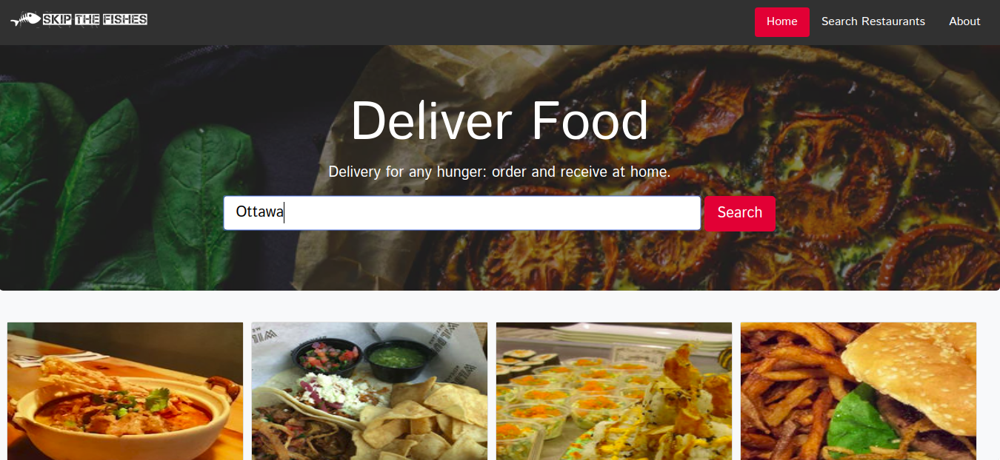
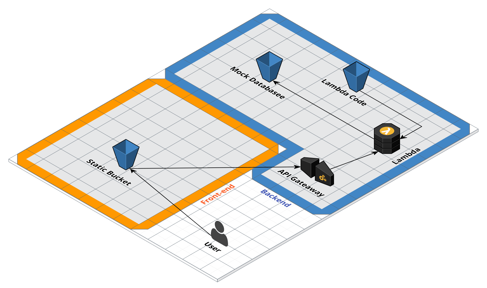

# Skip the Fishes

This is a project for VanHack's Hackaton. The description of the challenge was focused on high performance and high availability, so I tought about a solution high scalable with API Gateway and Lambda creating a serverless architecture and a static website hosted on AWS S3 distributed on cloudfront. By the way, I hate fish :(

http://frontend.skip.vdjuniorc.com.s3-website-us-west-2.amazonaws.com/



# Infrastructure

This project contains a mini fullstack food delivery website focused on the specifications above. The architecture blueprint that I thought:


but, because of a time limit I have implemented just a few functional parts of the solution:



By hosting a website statically you don't have to concern about availability, because S3 service offer that for us. But, what about the backend? If your solution isn't well configured you can suffer downtime on backend, for that reason I choose the framework Zappa that exports a Flask / Django app into a serverless architecture. By doing this you don't have any problem with your backend availability. The last but not least, the database I choose for high scalability is a noSQL database, because it's not going to suffer with a increased number of access like a relational database would.

I implemented a mock database and a static web site hosting on S3 but the concept was this.

# DevOps

For creating a environment from scratch, just run the scripts inside the folder **infrastructure**:

The fist step is configure the AWS credentials on your machine, just type:

```sh
aws configure
```

and put your dev credentials.

Creating environment stack:

```sh
cd infrastructure
./create_env.sh
```

This script creates backend stack (API Gateway and Lambda functions) and Frontend (Static Website hosting Bucket) using zappa and cloudformation.

With this, at the end of the process you should can access the link on you AWS:
http://frontend.skip.vdjuniorc.com.s3-website-us-west-2.amazonaws.com/

To delete the environment stack, just run:

```sh
cd infrastructure
./create_env.sh
```

And if you have updated on a frontend or backend project, you can just run the **deploy.sh** inside frontend and backend folders respectively.

# Frontend

I chose Angular 4 for Frontend specially because I was afraid that something went wrong, compromising all the project, since I've not made complex projects with React.js yet. The reason they are alike just shows me that it's easier to learn too and I would love it =D

 The front-end was developed using Bootstrap as CSS framework and some mock images from internet. This was easy and it just make some calls to our backend REST API.

# Backend

The backend was developed using Flask and Zappa to deploy into a serverless architecture. This backend has it's own mock methods to return food and restaurants data (extracted from zomato API).