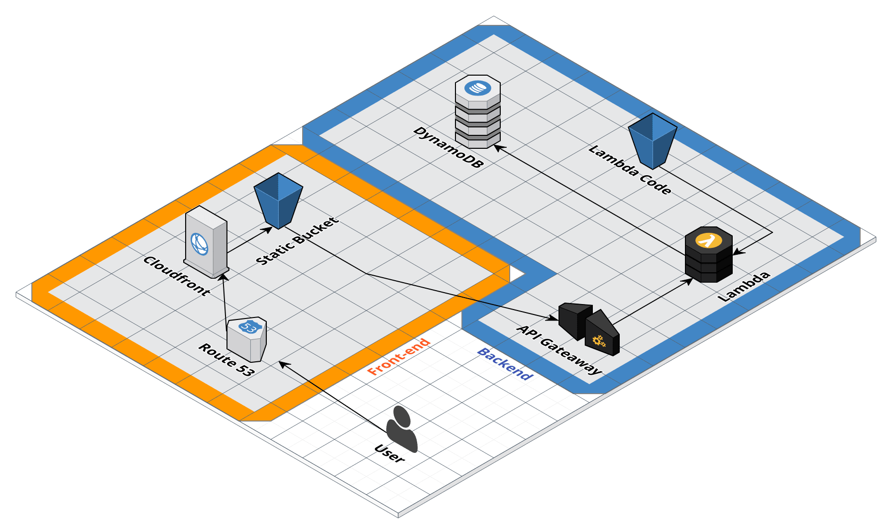

# Skip the Fishes

This is a project for VanHack's Hackaton. The description of the challenge was focused on high performance and high availability, so I tought about a solution high scalable with API Gateway and Lambda creating a serverless architecture and a static website hosted on AWS S3 distributed on cloudfront. By the way, I hate fish :(

http://frontend.skip.vdjuniorc.com.s3-website-us-west-2.amazonaws.com/

# Infrastructure

This project contains a mini full stack food delivery website focused on the premises above. The architecture blueprint that I tought was:

but, because of a time limit I have implemented just a few functional parts of the solution:

By hosting a website statically you don't have to concern about availability, because S3 service offer that for us. But, what about the backend? If your solution isn't well configured you can suffer downtime on backend, for that reason I choose the framework Zappa that exports a Flask / Django app into a serverless architecture. By doing this you don't have any problem with your backend availability. The last but not least, the database I choose for high scalability is a noSQL database, because it's not going to suffer with a increased number of access like a relational database would.

I implemented a mock database and a static web site hosting on S3 but the concept was this.

# Frontend

The front-end was developed in Angular 4 using Bootstrap as CSS framework. This was a easy one and this guy just make some calls to out backend rest API

# Backend

The backend was developed using Flask and Zappa to deploy into a serverless architecture. This backend has it's own mock methods to return food and restaurants data.
